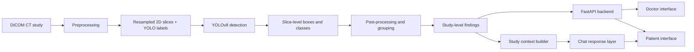

# NoduleX: Integrated AI Tool for Detecting and Classifying Lung Nodules

NoduleX is a prototype lung nodule review platform that combines CT preprocessing, AI-assisted nodule detection, study-level finding analysis, and a patient-facing chat experience in one workflow. The system is designed to support radiologists reviewing chest CT scans while also providing a constrained, scan-aware explanation layer for patients.

This repository reflects the current implemented system, not the full originally proposed vision. The strongest contribution is end-to-end integration: a DICOM study can be uploaded, processed locally, reviewed by a doctor, and translated into a patient-visible summary inside the same tool.

## What NoduleX currently does

- Uploads DICOM CT studies through a local web interface
- Preprocesses CT data into a YOLO-compatible 2D slice dataset
- Detects candidate lung nodules with a YOLOv8-based pipeline
- Groups slice-level detections into study-level findings
- Estimates size, approximate volume, and a coarse screening risk label
- Lets doctors review findings and accept or reject them
- Shows only accepted findings in the patient view
- Supports a scan-aware patient chatbot grounded in study context

## Current system architecture

NoduleX has three main components:

1. DICOM preprocessing and 2D YOLO-based lung nodule detection
2. Deterministic post-processing for grouping, measurement, and screening-oriented risk labeling
3. A local doctor/patient web interface with a scan-aware chatbot



## Detection pipeline

The detection system uses a single-stage YOLO architecture to balance speed and computational cost.

### Preprocessing

The preprocessing pipeline:

- identifies the dominant CT series
- removes localizer images when possible
- sorts slices by spatial order
- converts pixel data to Hounsfield Units using DICOM rescale metadata
- applies lung-window normalization in the range `[-1000, 400]`
- resamples the volume to isotropic `1 mm x 1 mm x 1 mm`
- resizes each slice to `640 x 640`
- converts slices to three channels for YOLO input

The app also preserves original-order viewer slices so users can browse scans in a way that better matches the uploaded study.

### Label generation

For supervised training, LIDC-IDRI XML annotations are converted into YOLO-style 2D bounding boxes. ROI contours are mapped to the nearest processed slice by z-position, converted to rectangles, and filtered so that only nodules with estimated diameter `>= 3 mm` are retained.

The current class mapping is based on LIDC texture score:

- `1-2` -> ground-glass
- `3` -> part-solid
- `4-5` -> solid

### Training and inference

Training uses the Ultralytics YOLO interface. During inference, confidence filtering and non-max suppression remove low-confidence or overlapping detections. Adjacent slice detections are then grouped into study-level findings.

## Post-processing and finding analysis

The current codebase does not yet implement the originally proposed metadata-enhanced 3D CNN malignancy classifier.

Instead, NoduleX performs deterministic post-processing after slice-level detection:

- groups nearby detections across adjacent slices
- suppresses weak single-slice detections
- filters grouped findings using geometric constraints
- estimates shortest and longest diameter in millimeters
- estimates approximate ellipsoidal volume
- assigns the final density class by majority vote
- assigns a coarse screening risk label: low, intermediate, or high

This risk output is a screening heuristic, not a learned malignancy probability.

## Doctor and patient interface

NoduleX is deployed as a local FastAPI web application.

### Doctor workflow

- upload a DICOM folder or file set
- run local analysis
- browse CT slices with overlays
- inspect AI-generated findings
- accept or reject findings

### Patient workflow

- view doctor-accepted findings only
- see a plain-language summary of the selected accepted nodule
- ask scan-specific questions through the patient chat interface

## Scan-aware chatbot

The patient chat layer is grounded in:

- the current study record
- doctor-accepted findings
- the study summary
- recent chat history

The backend supports a configured model endpoint plus a built-in fallback mode. The current implementation is intended for explanation and education, not treatment guidance or autonomous diagnosis.

## Dataset

Download the LIDC-IDRI data and related project assets from:

- [Google Drive dataset folder](https://drive.google.com/drive/folders/1odQg7c-d9joJnZ3e1FmliXgGxUZjzqrK?usp=drive_link)

After downloading, place the dataset wherever you prefer on your machine and pass that location into the ML scripts with command-line flags.

## Repository structure

```text
backend/    FastAPI app, APIs, data models, services, and static app assets
frontend/   React + TypeScript client for doctor/patient workflows
ml/         DICOM preprocessing, label conversion, training, inference, and evaluation scripts
docs/       Architecture notes, requirements mapping, and wireframes
scripts/    Convenience scripts for local training and evaluation runs
```

## Running locally

### Backend

1. Create a Python environment.
2. Install the dependencies in `backend/requirements.txt`.
3. Start the API:

```bash
uvicorn app.main:app --reload --app-dir backend
```

On macOS, you can also use:

```bash
./start_nodulex.command
```

The backend runs locally at `http://127.0.0.1:8000`.

### Frontend

1. Install dependencies from `frontend/package.json`.
2. Start the frontend development server:

```bash
npm run dev --prefix frontend
```

### ML pipeline

A typical dataset preparation and training flow is:

```bash
python ml/scripts/prepare_lidc_dataset.py --lidc-root /path/to/LIDC-IDRI --output-root ./artifacts/lidc
python ml/scripts/train_yolo.py --dataset-yaml ./artifacts/lidc/dataset.yaml
python ml/scripts/evaluate_yolo.py --dataset-yaml ./artifacts/lidc/dataset.yaml --weights ./artifacts/runs/train/weights/best.pt
```

### Count accuracy evaluation

Use `ml/scripts/evaluate_count_accuracy.py` to compare predicted patient-level nodule counts against the official `lidc-idri-nodule-counts-6-23-2015.xlsx` spreadsheet for nodules `>= 3 mm`.

```bash
python ml/scripts/evaluate_count_accuracy.py \
  --manifest ./artifacts/lidc/manifest.json \
  --count-xlsx /path/to/lidc-idri-nodule-counts-6-23-2015.xlsx \
  --weights ./artifacts/runs/lidc_yolo/weights/best.pt \
  --output-json ./artifacts/experiments/lidc_count_eval/count_metrics.json \
  --output-csv ./artifacts/experiments/lidc_count_eval/count_predictions.csv
```

### First-200-patient experiment

```bash
python ml/scripts/run_first200_experiment.py \
  --lidc-root /path/to/LIDC-IDRI \
  --count-xlsx /path/to/lidc-idri-nodule-counts-6-23-2015.xlsx \
  --prepared-root ./artifacts/lidc \
  --output-root ./artifacts/experiments/lidc_first200 \
  --patient-count 200 \
  --epochs 5 \
  --batch 8 \
  --device cpu
```

## Experimental snapshot

The current repository includes preliminary experiments centered on the detection stage.

For the later logged detection run described in the report:

- precision: `0.63246`
- recall: `0.14166`
- mAP@0.50: `0.17224`
- mAP@0.50:0.95: `0.07896`

At confidence `0.25` and IoU `0.5`, one reported evaluation also showed:

- 94 true positives
- 457 false positives
- 200 false negatives
- precision: `0.1706`
- recall: `0.3197`
- F1: `0.2225`

These results indicate improvement over earlier near-failure runs, but performance remains preliminary with substantial missed nodules and false positives.

## Limitations

- This is a prototype, not a validated clinical system.
- The planned metadata-enhanced 3D CNN malignancy classifier is not yet implemented.
- Current risk labels are rule-based screening heuristics rather than learned malignancy predictions.
- Detection results are still limited by small training experiments and cleaned-subset evaluation.
- The patient chatbot has not yet been evaluated through a formal user study.

## Chat configuration

Create a root `.env` file if you want the patient assistant to call an external model endpoint:

```bash
LUMENAI_OPENAI_API_KEY=your_key_here
LUMENAI_PATIENT_CHAT_MODEL=gpt-4.1-mini
LUMENAI_OPENAI_BASE_URL=https://api.openai.com/v1
```

If no key is configured, the backend uses its built-in fallback replies.

## Status

NoduleX is best understood as a working end-to-end prototype of an integrated lung nodule review workflow. Future work should focus on larger cleaned training cohorts, stronger detection performance, implementation of the planned 3D malignancy model, and broader evaluation against stronger baselines.
