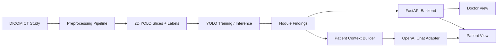
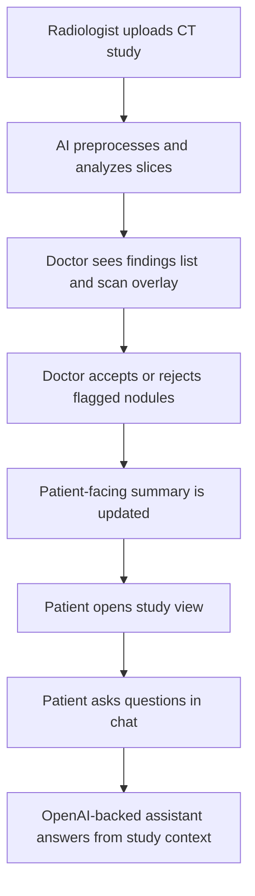

# NoduleX Lung Nodule Workbench

NoduleX is a full-stack starter for a lung nodule review tool with:

- A doctor view for CT upload, AI-assisted nodule review, overlay toggling, and accept/reject decisions
- A patient view for annotated scan summaries and a patient-specific nodule education chatbox
- A YOLO-oriented preprocessing and annotation pipeline for LIDC-IDRI
- Training, evaluation, and inference scaffolding designed around the product requirements

## Project structure

```text
backend/    FastAPI app, APIs, data models, chat orchestration
frontend/   React + TypeScript browser client with doctor/patient views
ml/         DICOM preprocessing, annotation conversion, train/eval/inference scripts
docs/       Architecture notes and UX flow
```

## Product requirements covered

- DICOM ingestion and preprocessing for YOLO
- Nodule counting, sizing, and classification
- Doctor workflow with findings list, overlay toggle, and accept/reject actions
- Patient workflow with scan overview and contextual Q&A
- 70/30 LIDC-IDRI split for train/test
- Internal target metrics:
  - Sensitivity >= 90% for nodules >= 3 mm
  - False positives < 1 per scan
  - Inference time < 30 seconds per study

## Architecture overview



## UX flow



## Dataset

Download the LIDC-IDRI data and related project assets from:

- [Google Drive dataset folder](https://drive.google.com/drive/folders/1odQg7c-d9joJnZ3e1FmliXgGxUZjzqrK?usp=drive_link)

After downloading, place the dataset wherever you prefer on your machine and point the ML scripts at that location with the command-line flags shown below. The README does not assume any computer-specific directory layout.

## Running locally

### Backend

1. Create a Python environment.
2. Install the dependencies listed in `backend/requirements.txt`.
3. Start the API:

```bash
uvicorn app.main:app --reload --app-dir backend
```

For this repo on macOS, you can also use:

```bash
./start_nodulex.command
```

That launches the local backend at `http://127.0.0.1:8000`. The standalone page at `backend/app/static/index.html` can also call that same local backend even when opened directly from disk.

### Frontend

1. Install the dependencies in `frontend/package.json`.
2. Start the browser app:

```bash
npm run dev --prefix frontend
```

### ML pipeline

The ML scripts expect a downloaded copy of LIDC-IDRI plus its XML annotations. A typical preparation flow is:

```bash
python ml/scripts/prepare_lidc_dataset.py --lidc-root /path/to/LIDC-IDRI --output-root ./artifacts/lidc
python ml/scripts/train_yolo.py --dataset-yaml ./artifacts/lidc/dataset.yaml
python ml/scripts/evaluate_yolo.py --dataset-yaml ./artifacts/lidc/dataset.yaml --weights ./artifacts/runs/train/weights/best.pt
```

### Count accuracy evaluation with `lidc-idri-nodule-counts-6-23-2015.xlsx`

Use `ml/scripts/evaluate_count_accuracy.py` to compare the model's patient-level nodule counts with the official LIDC-IDRI spreadsheet column for nodules `>= 3 mm`. The script:

- runs the trained YOLO weights on each study in a prepared `manifest.json`
- tunes grouping thresholds on the validation split
- reports final patient-level count accuracy on the test split
- writes both a JSON summary and a per-patient CSV

General usage:

```bash
python ml/scripts/evaluate_count_accuracy.py \
  --manifest ./artifacts/lidc/manifest.json \
  --count-xlsx /path/to/lidc-idri-nodule-counts-6-23-2015.xlsx \
  --weights ./artifacts/runs/lidc_yolo/weights/best.pt \
  --output-json ./artifacts/experiments/lidc_count_eval/count_metrics.json \
  --output-csv ./artifacts/experiments/lidc_count_eval/count_predictions.csv
```

The evaluator writes:

- `count_metrics.json`: best tuned thresholds plus summary metrics
- `count_predictions.csv`: one row per patient with ground-truth and predicted counts

The JSON summary includes:

- `exact_match_accuracy`: fraction of patients where predicted count exactly matches the spreadsheet
- `within_one_accuracy`: fraction of patients where the prediction is off by at most one nodule
- `mae`: mean absolute error in nodules per patient
- `rmse`: root mean squared error
- `mean_bias`: positive means overcounting, negative means undercounting

If you want to run the first-200-patient experiment end to end, use:

```bash
python ml/scripts/run_first200_experiment.py \
  --lidc-root /path/to/LIDC-IDRI \
  --count-xlsx /path/to/lidc-idri-nodule-counts-6-23-2015.xlsx \
  --prepared-root ./artifacts/lidc \
  --output-root ./artifacts/experiments/lidc_first200 \
  --patient-count 200 \
  --epochs 5 \
  --batch 8 \
  --device cpu
```

## Chat configuration

Create a root `.env` file with your OpenAI settings before you want the patient assistant to use the API:

```bash
LUMENAI_OPENAI_API_KEY=your_key_here
LUMENAI_PATIENT_CHAT_MODEL=gpt-4.1-mini
LUMENAI_OPENAI_BASE_URL=https://api.openai.com/v1
```

If no OpenAI key is configured yet, the backend keeps using its built-in rule-based fallback replies.

## Notes

- The repository ships with a production-oriented scaffold, not a trained medical model.
- You still need to download LIDC-IDRI, prepare it locally, and train the YOLO weights before real inference.
- The patient chat now uses the OpenAI Responses API when `LUMENAI_OPENAI_API_KEY` is set, while still keeping study-grounded context and recent chat history.
